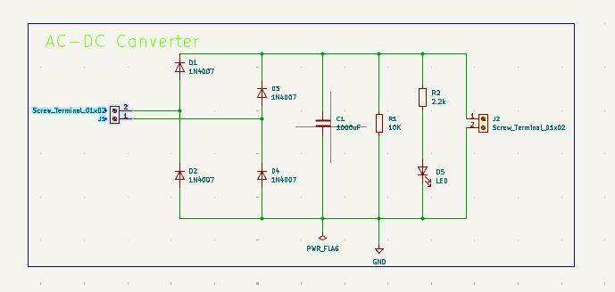
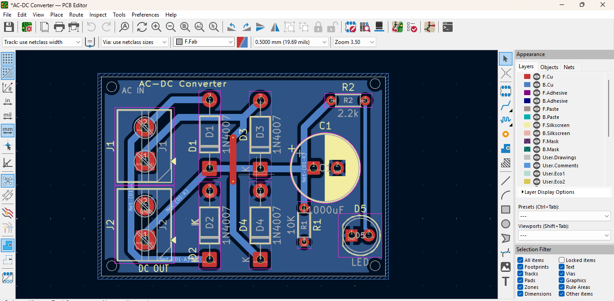
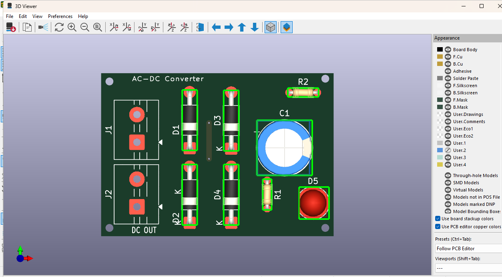
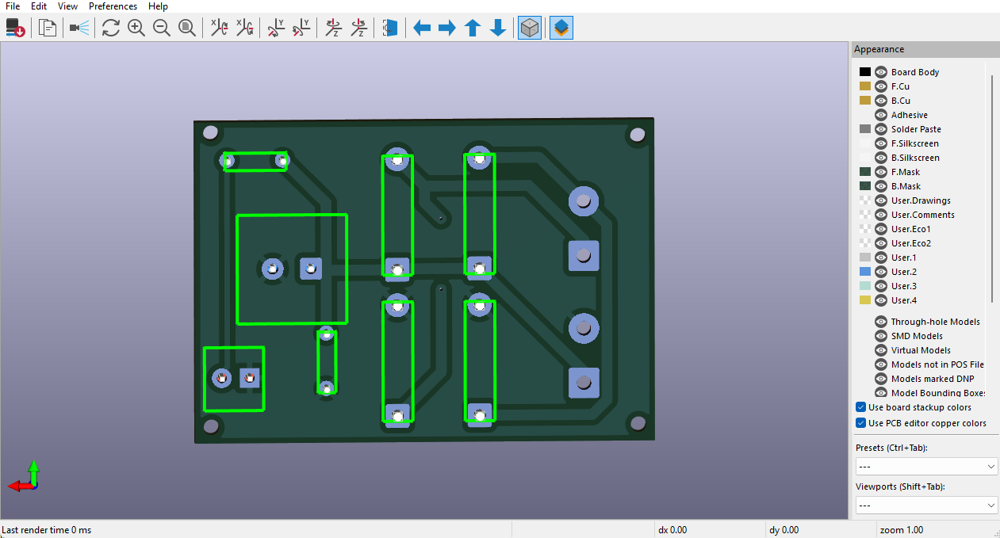

# AC-DC Converter PCB Design

## Overview

This project demonstrates the design of a simple AC-DC converter PCB using KiCad 9.

## Features

- Schematic Design
- PCB Layout
- Two Layer PCB
- Gerber Files
- Drill Files
- 3D PCB Model

## Software

- KiCad 9

## Components

- 4 × 1N4007 Diodes
- Electrolytic Capacitor
- LED
- Resistors
- Screw Terminals

## Project Images

## Schematic

## PCB Layout

## 3D View

## Author

Yogesh Budhalkar
